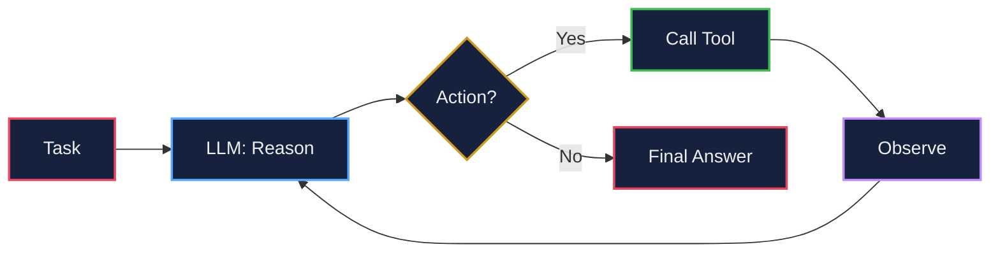
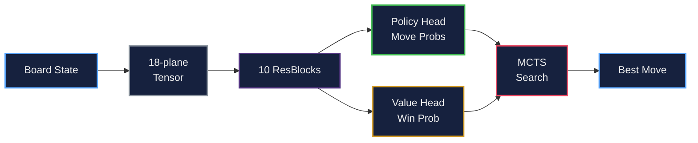
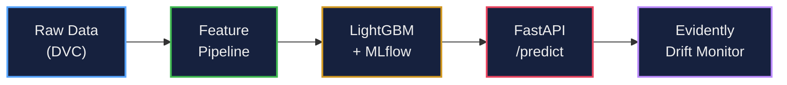
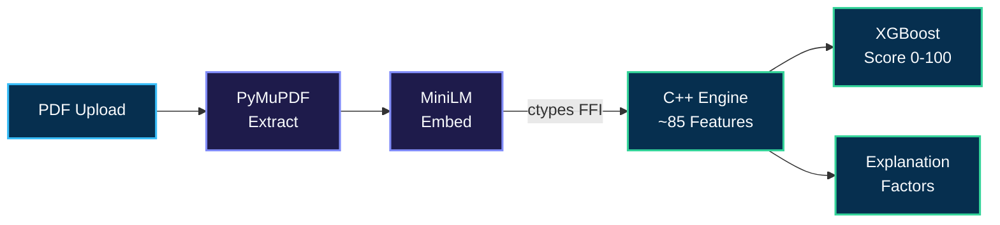
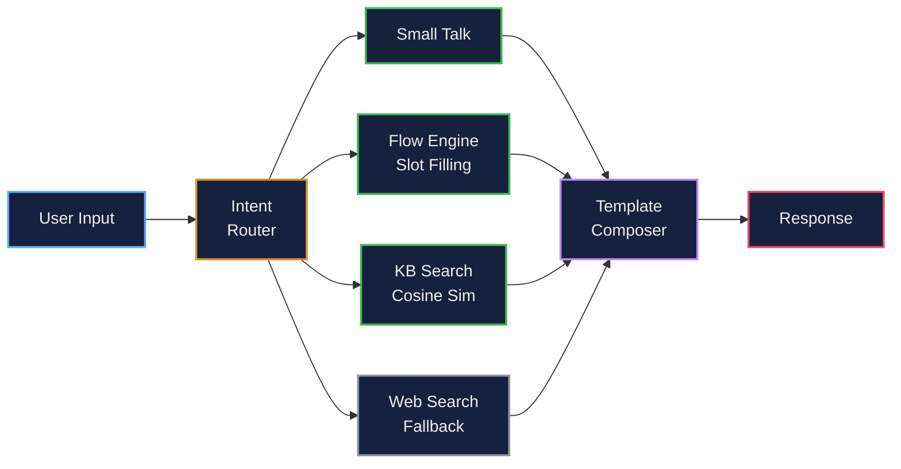
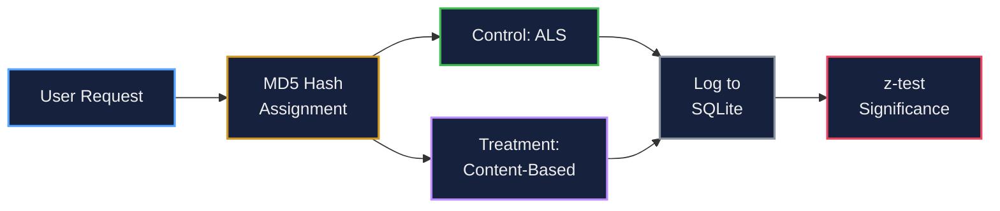
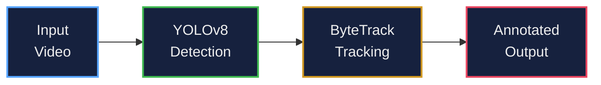

# Hey, I'm Anshuman

**B.Tech @ VIT Bhopal · Class of 2027 · Machine Learning & AI**

I care about the unglamorous middle part of ML — getting a model out of a notebook and into something that survives real data and real traffic. Outside of that, chess is enough of an obsession that I built an engine for it instead of just playing.

> [!NOTE]
> **Currently learning:** AI Agents · Vector Databases · Advanced RAG Architectures

---

`Build the mechanism, not the wrapper.`

**Chess engine?** No Stockfish — wrote the MCTS, the ResNet, the self-play loop.
**Resume scorer?** No LLM — wrote the parser, the trie, the ranker in C++.
**Agent?** No LangChain — wrote the ReAct loop, the tool schemas, the guardrails.

---

## Pinned Projects

These are the ones I'd actually want you to look at first.

---

### LLM Agent From Scratch

A tool-using ReAct (Reason + Act) agent built **without any agent framework** — no LangChain, no LangGraph, no CrewAI. Everything an off-the-shelf framework would normally hand you is hand-rolled here instead, to prove out a real understanding of agent internals rather than framework glue.

| Component | What it does |
|:---|:---|
| Reasoning loop | Hand-rolled ReAct loop — no LangChain/LangGraph/CrewAI |
| Tool schemas | Auto-generated tool-calling schemas from function signatures |
| Memory | Conversation and task-state memory |
| Eval harness | 4/4 eval suite passing, 12 unit tests passing |
| Guardrails | Input/output guardrails around tool use |
| Sandboxed execution | Isolated Docker container for the agent's code-execution tool |
| Tracing | Full JSONL execution tracing for debugging agent runs |

---

### Chess Engine with AlphaZero-style AI

This is the one closest to my heart. A complete chess engine and AI, built from the ground up in Python — no Stockfish wrappers. A full rules engine, a custom residual network, and a self-play MCTS training loop inspired by DeepMind's AlphaZero.

| Component | What it does |
|:---|:---|
| `chesseng.py` | Full rules engine: move generation, castling, en passant, promotions, check/mate |
| `NeuralNet.py` | 10-ResBlock network with policy head (move probabilities) + value head (position eval) |
| `mcts.py` | MCTS with UCB scoring, Dirichlet noise for exploration, and value backup |
| `BoardEncoder.py` | 18-plane tensor encoding of full board state |
| `Train.py` | Self-play training loop (A3C) |

---

### MLOps Demand Forecasting Pipeline

End-to-end MLOps pipeline for spatio-temporal traffic demand forecasting — data versioning, feature engineering, model training, API serving, and automated drift monitoring, all wired together with production tooling.

| Component | What it does |
|:---|:---|
| `src/features.py` | Geohash encoding, rush-hour flags, cyclical sine/cosine hour features |
| `src/train.py` | LightGBM training with RMSE, MAE, R² tracked on MLflow + DagsHub |
| `src/monitor.py` | Automated data drift detection with Evidently AI |
| `api/app.py` | FastAPI endpoint for real-time demand predictions |
| `ci.yml` | GitHub Actions CI running tests on every push |
| Storage | DVC + Google Drive remote, Docker containerized |

---

### TalentMatch AI v2

Resume / Job Description ATS match scorer — upload a resume PDF, paste a JD, and get a 0-100 match score with a matched/missing/partial skills breakdown and plain-English explanation of the strongest signals. v2 rebuilt the entire scoring path in native C++: **no LLM, no API key, fully deterministic.**

| Component | What it does |
|:---|:---|
| `cpp_core/parser/` | Deterministic regex-based resume parser (dates, contact info, sections) — replaced the old Groq/LLM parsing step |
| `cpp_core/skills/` | Aho-Corasick trie + synonym matching against a canonical skill taxonomy |
| `cpp_core/retrieval/` | BM25 probabilistic text retrieval for semantic/keyword overlap |
| `cpp_core/features/` | ~85-feature engineering pipeline (education, experience, skills, semantic) |
| `cpp_core/ranking/` | XGBoost ranker with a deterministic linear-weight fallback |
| `cpp_core/explainability/` | Rule-based template explanations — no AI-generated narrative |
| `src/bridge.py` | ctypes FFI bridge — Python only extracts PDF text and generates embeddings, C++ does all scoring |
| `app.py` | Gradio UI; also ships a FastAPI backend, web frontend, and Chrome extension |

v1 → v2 was a full de-LLM-ification: Groq/`llama-3.3-70b` parsing, LLM skill extraction, the hardcoded 60/40 `HeuristicRanker`, and AI-generated narrative explanations were all replaced with deterministic native code. No `.env` file or API key required to run it.

---

### Hybrid C++/Python Chatbot (No LLM)

A conversational chatbot that reasons and responds **without any generative model** — no OpenAI, no Groq, no text generation of any kind. Responses are retrieved, computed, and composed deterministically via knowledge-base search, dialogue management, and hand-written neural components, with Python orchestrating and C++ doing the compute-heavy work.

| Component | What it does |
|:---|:---|
| `cpp/src/lstm_cell.cpp` | Hand-written LSTM cell implemented from scratch in C++ |
| `cpp/src/attention_pooling.cpp` | Custom attention-pooling layer for sequence representations |
| `cpp/src/embedding_search.cpp` | Fast cosine-similarity search over the knowledge base |
| `cpp/src/cognitive_engine.cpp` | Core native inference engine, exposed to Python via pybind11 |
| `orchestrator/router.py` | Intent router dispatching between small talk, flow engine, KB search, and web search |
| `orchestrator/flow_engine.py` | Multi-turn slot-filling conversation engine |
| `orchestrator/dialogue_state.py` | Conversation history and dialogue-state tracking |
| `orchestrator/composer.py` | Template + slot-filling response composition |
| `orchestrator/tool_dispatch/web_search.py` | Optional live web search fallback (Google Custom Search), offline by default |

Design principles: no LLMs, no generated text, fully deterministic, offline-first, with the embedding encoder swappable for a real model like `all-MiniLM-L6-v2` if desired.

---

### RAG Document QA — Hybrid Retrieval with Citations

Upload a PDF or text document, ask questions in plain English, and get answers grounded in the document with page-level source citations. Built with hybrid retrieval and a lightweight evaluation framework — no paid APIs beyond Gemini's free tier.

| Component | What it does |
|:---|:---|
| `src/ingest.py` | PyMuPDF extraction + chunking with overlap; page numbers preserved per chunk |
| `src/retriever.py` | FAISS vector search + BM25 fused with Reciprocal Rank Fusion |
| `src/generator.py` | Numbered [n] citations mapped back to source chunks via Gemini Flash |
| `src/evaluate.py` | Groundedness scoring via cosine similarity — no second LLM call needed |
| `api/` + `app/` | FastAPI backend + Streamlit frontend |
| `tests/` + CI | pytest with deterministic fake embeddings; CI runs fully offline |

---

### Recommendation System with A/B Testing

An ALS-based recommender paired with a statistically rigorous A/B testing framework — the kind of evaluation layer most recsys portfolio projects skip entirely.

| Component | What it does |
|:---|:---|
| ALS model | Implicit-feedback matrix factorization for candidate recommendations |
| A/B assignment | Deterministic user bucketing via MD5 hashing, reproducible across runs |
| Significance testing | Two-proportion z-test with power analysis to validate uplift |
| Dashboard | Streamlit app for exploring results, served via Cloudflare Tunnel |
| `api/` | FastAPI serving layer for live recommendations |

---

### YOLOv8 + ByteTrack Multi-Object Tracking

Real-time object detection and multi-object tracking pipeline. Detects objects frame-by-frame with YOLOv8, assigns persistent tracking IDs via ByteTrack, and exports an annotated video with bounding boxes, class labels, confidence scores, and track IDs.

| Component | What it does |
|:---|:---|
| YOLOv8 detection | Frame-level object detection with Ultralytics YOLOv8 |
| ByteTrack | Multi-object tracking with persistent IDs across frames |
| Annotation | Bounding boxes, class labels, confidence scores, track IDs burned into output video |
| Gradio interface | Interactive testing without touching code |
| MLflow | Experiment tracking integration |

**Applications:** traffic monitoring, smart surveillance, sports analytics, crowd monitoring, retail analytics

---

## Other Builds

A few more things I've shipped, worth a quick look if you're curious:

| Project | What it is |
|:---|:---|
| **[federated-learning-sim](https://github.com/AnshumanJ28/federated-learning-sim)** | Privacy-preserving FedAvg simulation across virtual clients (Flower + PyTorch), benchmarked against centralized training on IID and non-IID splits, with client dropout modeling, an optional differential-privacy layer (Opacus), MLflow tracking, and a Dockerized serving API |
| **[rag-document-chatbot](https://github.com/AnshumanJ28/rag-document-chatbot)** | A second take on RAG: MMR retrieval + cross-encoder re-ranking, Groq's Llama 3.1 for generation, and MLflow-tracked queries in a Gradio chat UI |
| **[NexusTwin](https://github.com/AnshumanJ28/NexusTwin)** | AI digital twin for smart building energy monitoring: simulated live sensor data, anomaly detection, forecasting, and optimization recommendations |
| **[Diabatic-B5](https://github.com/AnshumanJ28/Diabatic-B5)** | Retinal disease classification with EfficientNet-B5, trained on APTOS 2019 and tested for generalization on RFMiD |

---

## Tech Stack

**Languages**

**ML / Deep Learning**

**LLM, Agents & RAG**

**Systems & Native Performance**

**Document & NLP Processing**

**MLOps & Deployment**

**Federated & Privacy-Preserving ML**

**Tools & Platforms**

---

## GitHub Stats

## LeetCode Stats

---

Always up for talking ML, chess, or why your pipeline broke at 2am.

